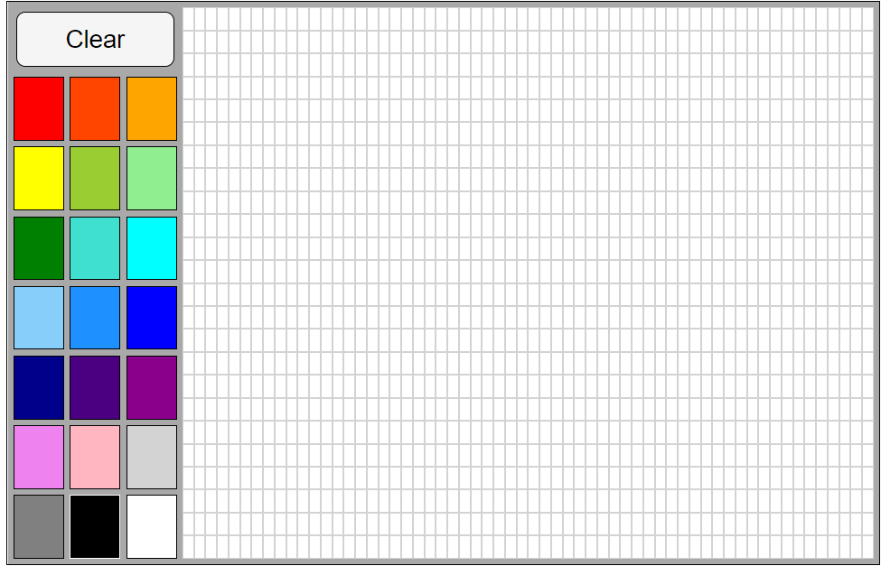

# What You Will Create:

You can see the working project [here](https://devtlv.github.io/coloring_squares/) 

1. Select a color
2. Draw what you want

----------

# What You Will Learn

    * DOM Events
    * DOM tree

----------

# Project Brief

Welcome to **Coloring Squares**.

Your task is to build a coloring game similar to the working project above.

You will need to use HTML, CSS and JS to accomplish this task.

## A Few Things To Think About…

1. HTML, CSS:

    * How will you make the grid of colors?
    * How will you make the grid of blank squares?
    * Hint… GRID :P

2. JS:

    * How does a user choose a color?
    * How does drawing work? How can you tell when the user is clicking and dragging?
    * Hint, look at the JS events `mousedown`, `mouseup`, and `mouseover`.

# Good Luck!

